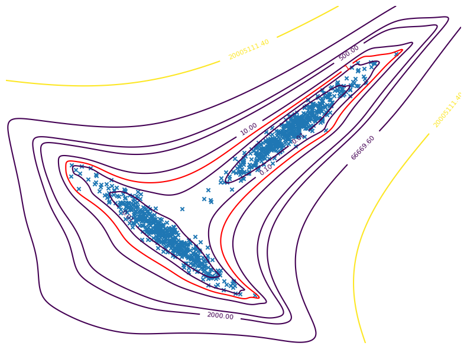

# CRISTAL

ChRISToffel Anomaly Locator (CRISTAL)  is an anomaly detection framework based on the Christoffel Function.

For installation instructions and usage examples, please refer to the documentation at [CRISTAL Documentation](https://fgrivet.github.io/CRISTAL/).

    

