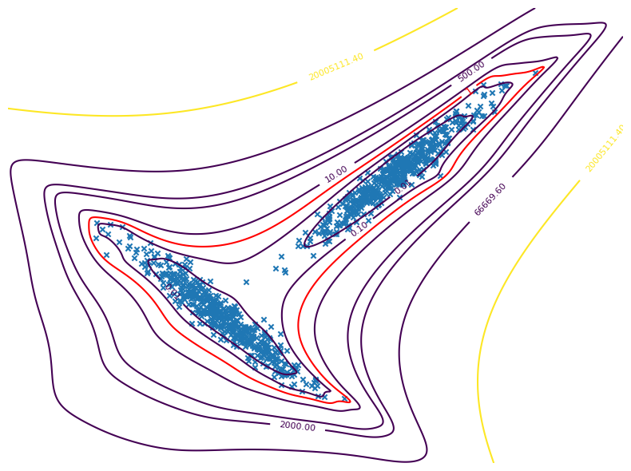

# CRISTAL

## Description

**C**h**RIST**offel **A**nomaly **L**ocator (CRISTAL)  is an anomaly detection framework based on the Christoffel Function.


## Content

This package implements several Christoffel Function-based methods for Anomaly Detection:

- **Dynamical version** (`DyCF`) - for low dimensional ($< 8$), high-sampled/streaming use cases - [paper](https://doi.org/10.1007/s41060-024-00581-2)
  
- **Kernel-based version** (`KernelCF`) - for high dimensional, low-sampled use cases - [paper](https://doi.org/10.48550/arXiv.1806.06775)

- **Kro&#243; Lubinski version** (`NeedleCF`) - for fast approximation 

- **Univariate version** (`UCF`) - for **all cases** - paper incoming


## Installation and Documentation

For installation instructions and usage examples, please refer to the documentation at [CRISTAL Documentation](https://fgrivet.github.io/CRISTAL/).


## Citation
If you use this work in your research, please cite it as:

```bibtex
inconming
```


<div align="center">
    
</div>