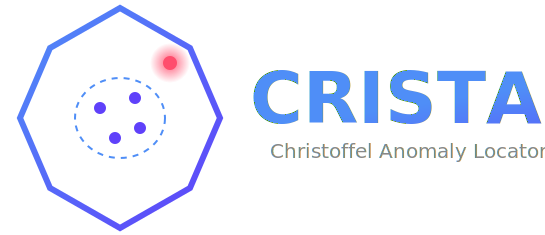

CRISTAL Documentation
=====================

Welcome to the CRISTAL package documentation!

.. note::
   Version |release| released on |release_date|

   Authors: |author|

   License: |license|

   .. raw:: html

      

         
         
         
         
      

.. toctree::
   :maxdepth: 2
   :hidden:

   Install <install>
   User Guide <user_guide>
   API <API/cristal>
   Examples <examples>
   Release Notes <release_notes/releases>
   References <references>
   Test Coverage <coverage>

